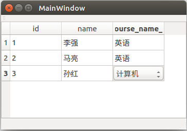

###############
17. 数据库和XML
###############

17.1 数据库
=============

17.1.1 连接到数据库
----------------------

1. SQL 数据库驱动
^^^^^^^^^^^^^^^^^^^^

+-------------+---------------------------------------------+
| Driver Type | Description                                 |
+=============+=============================================+
| QDB2	      | IBM DB2                                     |
+-------------+---------------------------------------------+
| QIBASE      |         Borland InterBase Driver            |
+-------------+---------------------------------------------+
| QMYSQL      |         MySQL Driver                        |
+-------------+---------------------------------------------+
| QOCI	      | Oracle Call Interface Driver                |
+-------------+---------------------------------------------+
| QODBC	      | ODBC Driver (includes Microsoft SQL Server) |
+-------------+---------------------------------------------+
| QPSQL	      | PostgreSQL Driver                           |
+-------------+---------------------------------------------+
| QSQLITE     |         SQLite version 3 or above           |
+-------------+---------------------------------------------+
| QSQLITE2    | SQLite version 2                            |
+-------------+---------------------------------------------+
| QTDS	      | Sybase Adaptive Server                      |
+-------------+---------------------------------------------+

.. literalinclude:: ../../../src/17/17-1/databaseDriver/main.cpp
    :language: cpp
    :encoding: utf-8

2. 创建数据库连接
^^^^^^^^^^^^^^^^^^^^

a)

.. literalinclude:: ../../../src/17/17-2/databaseDriver/connection.h
    :language: cpp
    :encoding: utf-8

.. literalinclude:: ../../../src/17/17-2/databaseDriver/main.cpp
    :language: cpp
    :encoding: utf-8

b)

.. literalinclude:: ../../../src/17/17-3/databaseDriver/connection.h
    :language: cpp
    :encoding: utf-8

.. literalinclude:: ../../../src/17/17-3/databaseDriver/main.cpp
    :language: cpp
    :encoding: utf-8

17.1.2 执行SQL语句
----------------------

1. 执行一个查询
^^^^^^^^^^^^^^^
    
    略

2. 浏览结果集
^^^^^^^^^^^^^^

.. literalinclude:: ../../../src/17/17-4/databaseDriver/connection.py
    :language: python
    :encoding: utf-8

.. literalinclude:: ../../../src/17/17-4/databaseDriver/main.py
    :language: python
    :encoding: utf-8

3. 插入、更新、删除记录
^^^^^^^^^^^^^^^^^^^^^^^^^^^

.. literalinclude:: ../../../src/17/17-5/databaseDriver/connection.h
    :language: cpp
    :encoding: utf-8

.. literalinclude:: ../../../src/17/17-5/databaseDriver/main.cpp
    :language: cpp
    :encoding: utf-8

4. 事物
^^^^^^^^^^^^^^^^

17.1.3 使用SQL模型类
--------------------

除了QSqlQuery, Qt还提供了3个更高级的类来访问数据库,分别是:
QSqlQueryModel、QSqlTableModel、QSqlRelationalTableModel。
这三个类都是从QAbstractTableModel派生来的，可以很容易地实现将
数据库中的数据在QListView和QTableView等项视图中显示。
使用这些类的另一个好处，这样编写的代码很容易的适应其他数据源。

例如，如果开始使用了，QSqlTableModel,而后来要改为使用XML文件来存储数据，
这样需要做的仅是更换一个数据模型。

1. SQL查询模型
^^^^^^^^^^^^^^

QSqlQueryModel 提供了一个基于SQL查询的制度模型。

**sqlModel.pro**

    添加一行代码:
    QT += sql

.. literalinclude:: ../../../src/17/17-6/sqlModel/sqlModel.pro
    :language: cpp
    :encoding: utf-8

**connection.h**

.. literalinclude:: ../../../src/17/17-6/sqlModel/connection.h
    :language: cpp
    :encoding: utf-8

**mainwindow.h**

.. literalinclude:: ../../../src/17/17-6/sqlModel/mainwindow.h
    :language: cpp
    :encoding: utf-8

**mainwindow.cpp**

    .. literalinclude:: ../../../src/17/17-6/sqlModel/mainwindow.cpp
        :language: cpp
        :encoding: utf-8

::

    这里先创建了，QSqlQueryModel对象，然后使用setQuery()来执行SQL语句进行查询整张student表，
    并使用setHeaderDate()来设置显示的表头。
    后面创建了视图，并将QSqlQueryModel对象作为其要显示的的模型。
    运行程序，效果如图(17-1)所示。
    这里要注意，其实QSqlQueryModel中存储的是执行完setQuery()函数后的结果集，
    所以视图中显示的是结果集的内容。

    QSqlQueryModel中还提供了 columnCount()返回一条记录中字段的个数;
    rowCount()返回结果集中记录的条数;
    record()返回第n条记录;index()返回制定记录的指定字段的索引;
    clear()可以清空模型中的结果集。
    也可以使用它提供的query()函数来获取QSqlQuery对象，
    这样就可以使用上一节讲到的QSqlQuery的相关内容来操作数据库了.

    还要注意一点，就是又使用setQuery()如果又使用setQuery()进行了新的查询，
    比如进行了插入操作，这时要想视图中可以显示操作后的结果，那么就必须再次查询整张表，
    也就是要同时执行下面两行代码:
    
        model->setQuery(QString("insert into student values(5,'薛静',10)"));
        model->setQuery("select * from student");

**main.cpp**

.. literalinclude:: ../../../src/17/17-6/sqlModel/main.cpp
    :language: cpp
    :encoding: utf-8

2. SQL表格模型
^^^^^^^^^^^^^^

    QSqlTableModel 提供了一个一次只能操作一个SQL表的读写/模型,它是QSqlQuery的更高层次的替代品，可以浏览和修改独立的SQL表，并且只需编写很少的代码，而且不需要要了解SQL语法。该模型默认是可读写的，如果想让其成为只读的模型，那么可以从视图进行设置例如：

    
    .. code-block:: cpp
        
        view.setEditTriggers(QAbstractItemView.NoEditTriggers)
    

.. literalinclude:: ../../../src/17/17-7/sqlModel/connection.py
    :language: python
    :encoding: utf-8

.. literalinclude:: ../../../src/17/17-7/sqlModel/mainwindow.py
    :language: python
    :encoding: utf-8

::

    使用setTable()来指定数据库表，然后使用select()函数进行查询，
    调用这两个函数就等价于: "select * from student;" 这条SQL语句。
    这里还可以使用 setFilter()来制定查询时的条件，在后面会看到这个函数的使用。
    在使用该模型以前，一般还要设置其编辑策略，
    它由QSqlTableModel::EditStrategy枚举变量定义，一共三个值,如表17-4所列。
    用来说明当数据库中的值被编辑后，什么情况下被提交修改.

+-------------------------------+-----------------------------------------------------------------------+
| Constant	              	| Description                                                           |
+===============================+=======================================================================+
| QSqlTableModel.OnFieldChange  | 所有对模型的改变都会立即应用到数据库                                  |
+-------------------------------+-----------------------------------------------------------------------+
| QSqlTableModel.OnRowChange    | 对一条记录的改变会在用户选择另一条记录时被应用                        |
+-------------------------------+-----------------------------------------------------------------------+
| QSqlTableModel.OnManualSubmit | 所有的改变都会在模型中进行缓存，直到调用submitAll()或者revertAll()函数|
+-------------------------------+-----------------------------------------------------------------------+

.. literalinclude:: ../../../src/17/17-7/sqlModel/main.py
    :language: python
    :encoding: utf-8

3. SQL关系表格模型
^^^^^^^^^^^^^^^^^^^^

 QSqlRelationalTableModel继承自QSqlTableModel,并且对其进行扩展，提供了对外键的支持。一个外键是表中的一个字段和其他表中的主键字段之间的一对一的映射。例如：student表中的course字段对应的是表中的id字段，那么就称字段course是一个外键。因为这里是course字段的值是一些数字，这样显示很不友好，使用关系表格模型，就可以将它显示为course表中的name字段值。

.. literalinclude:: ../../../src/17/17-8/sqlModel/connection.py
    :language: python
    :encoding: utf-8

.. literalinclude:: ../../../src/17/17-8/sqlModel/mainwindow.py
    :language: python
    :encoding: utf-8
    :emphasize-lines: 18,24

这里的setRelation()函数用来在两个表之间创建一个关系，
其中参数"2"表示student表中的编号为2的列，即第三个字段course是一个外键，
他映射到了course表中的id字段，
而视图需要向用户显示course表中的name字段的值。

Qt中还提供了一个QSqlRelationalDelegate委托类，
他可以为 QSqlRelationalTableModel 显示和编辑数据,这个委托为一个外键提供了一个QComboBox部件,来显示所有可选的数据,这样显得更加人性化。
使用这个委托很简单，在后续构造函数中添加如下一行代码:

    .. literalinclude:: ../../../src/17/17-8/sqlModel/mainwindow.py
       :language: python
       :encoding: utf-8
       :lines: 23-24

.. literalinclude:: ../../../src/17/17-8/sqlModel/main.py
    :language: python
    :encoding: utf-8

::

   可以根据自己的需要,来选择使用哪个模型。
   如果熟悉SQL语法，又不需要将所有的数据都显示出来那么只需要使用QSqlQuery就可以了,
   对于QSqlTableModel，它主要是用来显示一个单独表格的，
   而QSqlQueryModel可以用来显示任意一个结果集，
   如果想显示任意一个结果集，如果想显示任意一个结果集，
   而且想使其可读/写，那么建议子类化QSqlQueryModel,然后，重新实现flags()和setData()函数。

   这部分内容可以查看 Presenting Data in a Table View 关键字对应的帮助文档，
   也可以参考 Query Model示例程序。
   因为这3个模型都是基于模型/视图框架的，
   所以前一章讲的内容在这里都可以使用，例如可以使用 QDataWidgetMapper等。 
   关于数据库部分的应用，还可以参考一下SQL分类中的几个示例程序.

    

17.2 XML
========

17.2.1 DOM
----------

1. 使用DOM读取XML文档
^^^^^^^^^^^^^^^^^^^^^

.. literalinclude:: ../../../src/17/17-9/myDOM1/my.xml
    :language: xml
    :encoding: utf-8

.. literalinclude:: ../../../src/17/17-9/myDOM1/main.cpp
    :language: cpp
    :encoding: utf-8

.. literalinclude:: ../../../src/17/17-9/myDOM1/main.py
    :language: python
    :encoding: utf-8

2. 使用DOM创建和操作XML文档
^^^^^^^^^^^^^^^^^^^^^^^^^^^^^^^

.. literalinclude:: ../../../src/17/17-10/myDOM2/mainwindow.cpp
    :language: cpp
    :encoding: utf-8

.. literalinclude:: ../../../src/17/17-10/myDOM2/main.cpp
    :language: cpp
    :encoding: utf-8

**PyQt4**

.. literalinclude:: ../../../src/17/17-10/myDOM2_py/main.py
    :language: python
    :encoding: utf-8

.. literalinclude:: ../../../src/17/17-10/myDOM2_py/mainwindow.py
    :language: python
    :encoding: utf-8

17.2.2 SAX
---------------------

.. literalinclude:: ../../../src/17/17-11/mySAX/mysax.cpp
    :language: cpp
    :encoding: utf-8

.. literalinclude:: ../../../src/17/17-11/mySAX/main.cpp
    :language: cpp
    :encoding: utf-8

17.2.3 XML流
---------------------

.. literalinclude:: ../../../src/17/17-12/myXmlStream/main.cpp
    :language: cpp
    :encoding: utf-8

.. literalinclude:: ../../../src/17/17-13/myXmlStream/main.cpp
    :language: cpp
    :encoding: utf-8

